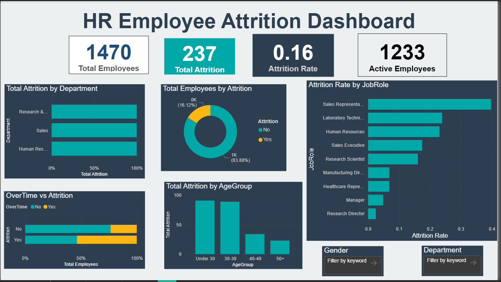
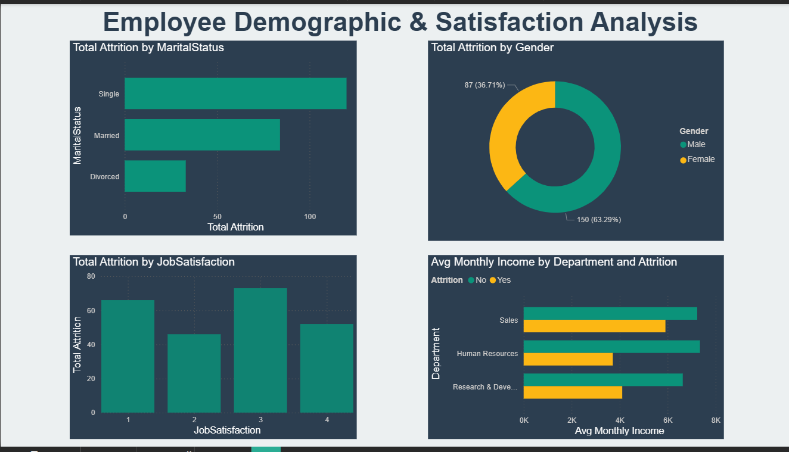
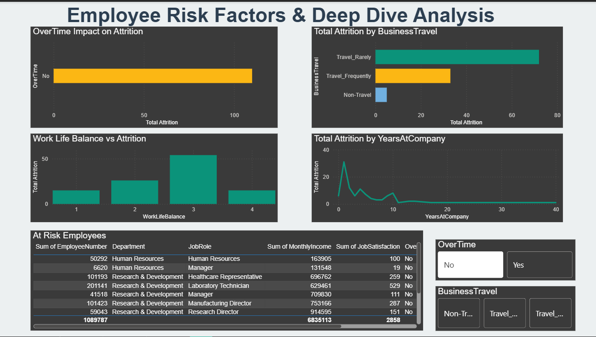

# HR Employee Attrition Analysis

## Project Overview
Analysis of IBM HR Analytics Employee Attrition dataset
containing 1,470 employee records to identify key drivers
of employee turnover.

## Tools Used
- Excel — Data cleaning, Pivot Tables & Charts
- SQL (MySQL) — Database creation & business queries
- Power BI — Interactive 3-page dashboard

## Key Findings
- Overall attrition rate: 16.12%
- Overtime workers leave 3x more than non-overtime
- Leavers earn $2,046 less per month than stayers
- Sales Representatives have highest attrition at 39.76%
- Employees under 30 leave the most at 23.76%

## Dashboard Pages
- ## Dashboard Screenshots

### Page 1 - Executive Overview

### Page 2 - Demographics

### Page 3 - Risk Factors

## Dataset
IBM HR Analytics Employee Attrition Dataset
Source: Kaggle
Records: 1,470 employees | 35 columns
